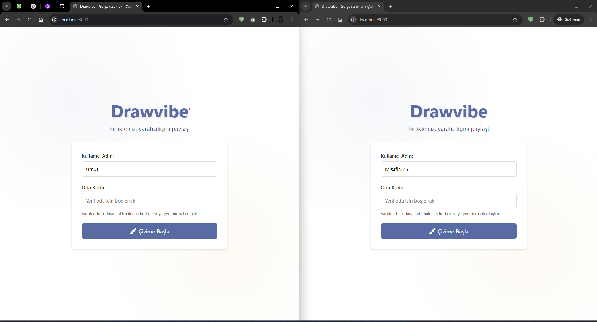
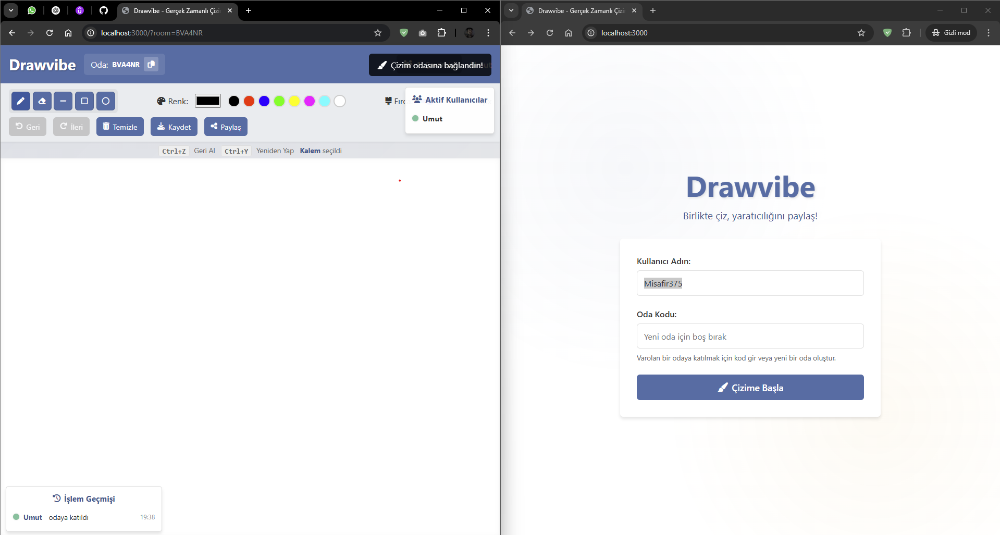
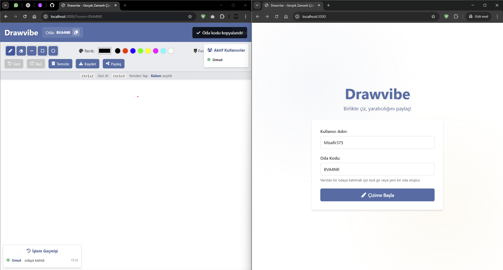
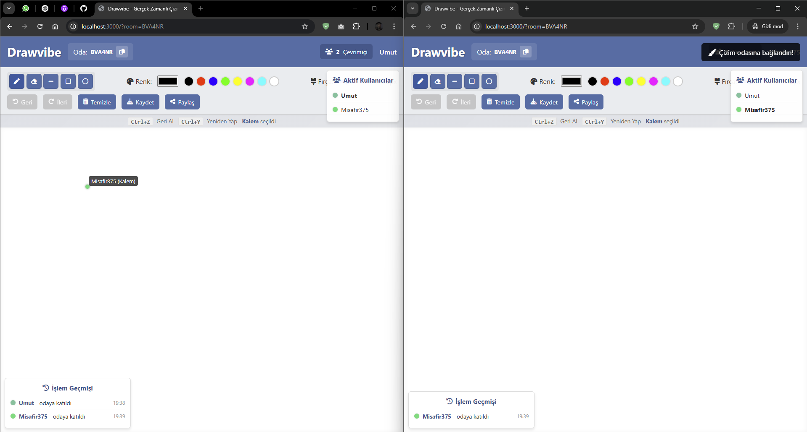
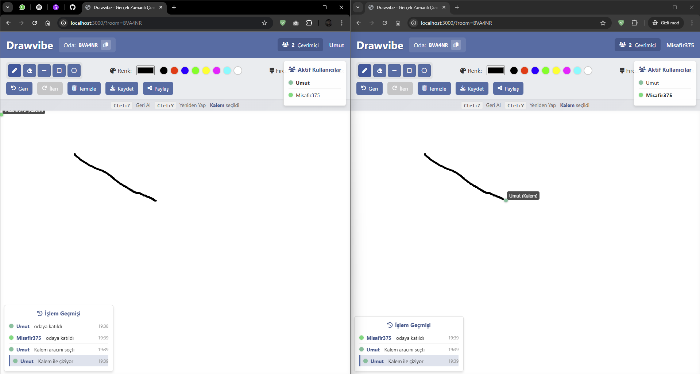
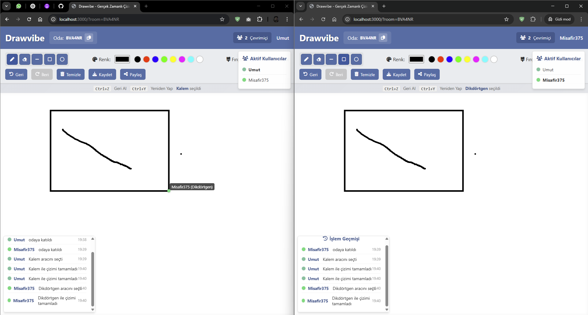
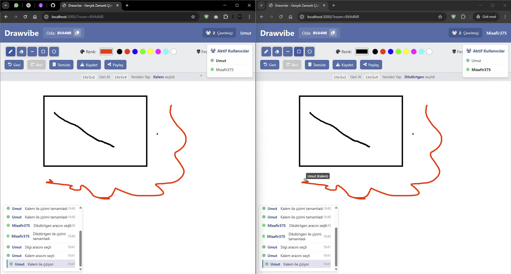

## 🌐 Live Demo

Try Drawvibe app now: [Click Here](https://drawvibe-production.up.railway.app)


# 🎨 Drawvibe

Drawvibe is a platform where people can share their creativity and draw together in real-time. Users can start drawing on a shared canvas with just a browser, without needing any additional software.

## 🚀 Features

- **Real-Time Drawing**: Every user's drawings are instantly transmitted to other users
- **User Cursors**: Everyone's mouse cursor is shown in real-time
- **Brush Settings**: Different colors and thicknesses can be selected
- **Board Clearing**: Reset the board with a single click
- **Save as Image**: Save your work in PNG format
- **Mobile Compatible**: Can be used with touch devices

## 🛠️ Installation

Follow these steps to run the project in your local environment:

```bash
# Clone the repository
git clone https://github.com/umutsevimcann/drawvibe.git
cd drawvibe

# Install dependencies
npm install

# Start the application
npm start
```

You can use the application by going to `http://localhost:3000` in your browser.

## 🧰 Technologies

- **Node.js + Express.js**: Web server
- **Socket.io**: Real-time data communication
- **HTML5 Canvas**: Drawing operations
- **JavaScript**: Client-side programming
- **CSS**: Interface design

## 📷 Screenshots









## 📝 License

Published under MIT License. See [LICENSE](LICENSE) file for details. 