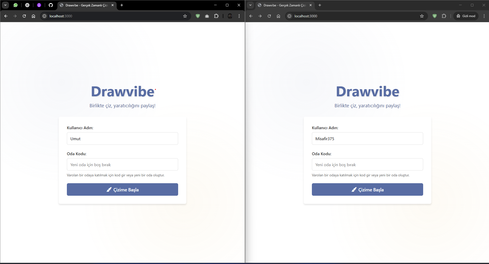
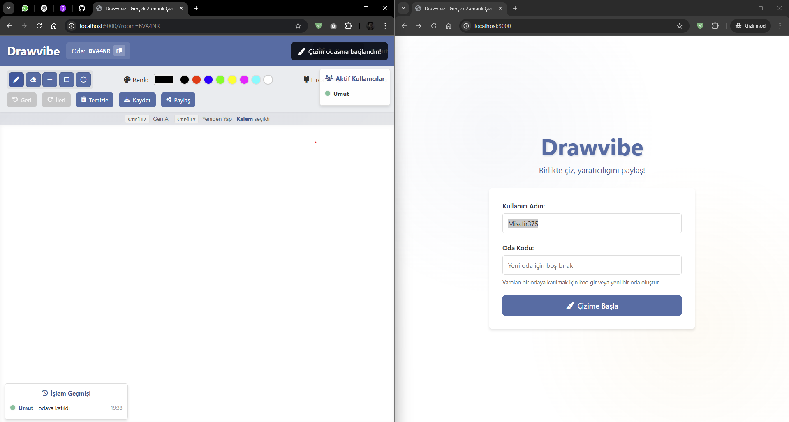
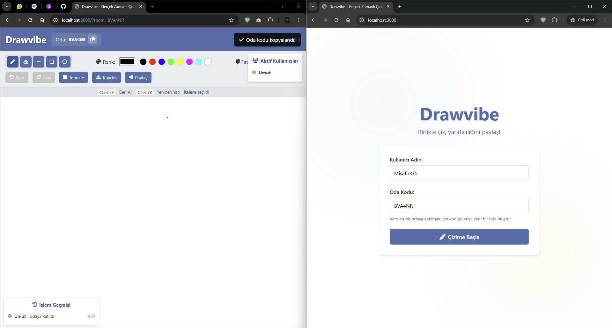
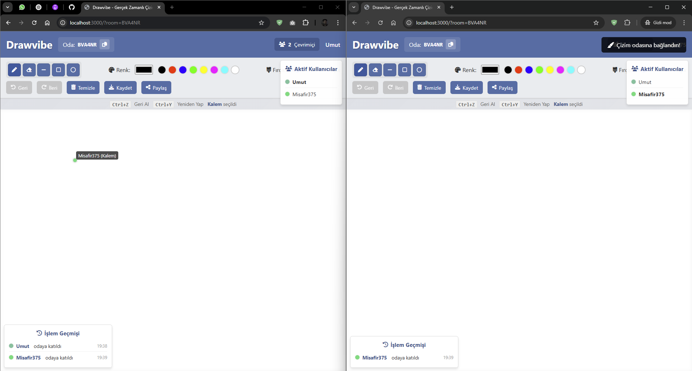
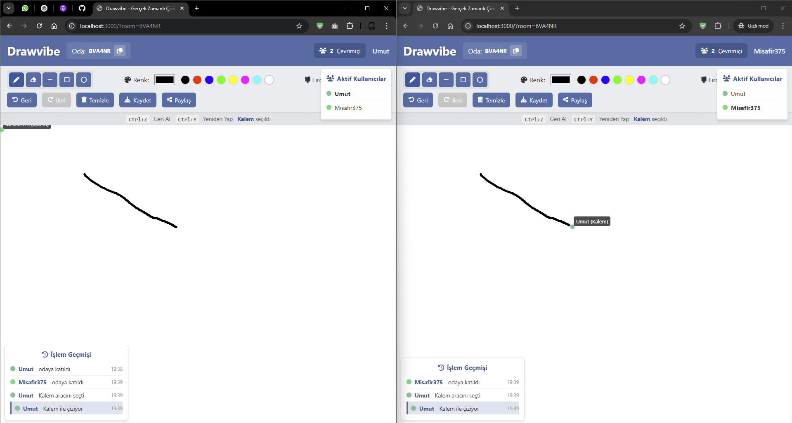
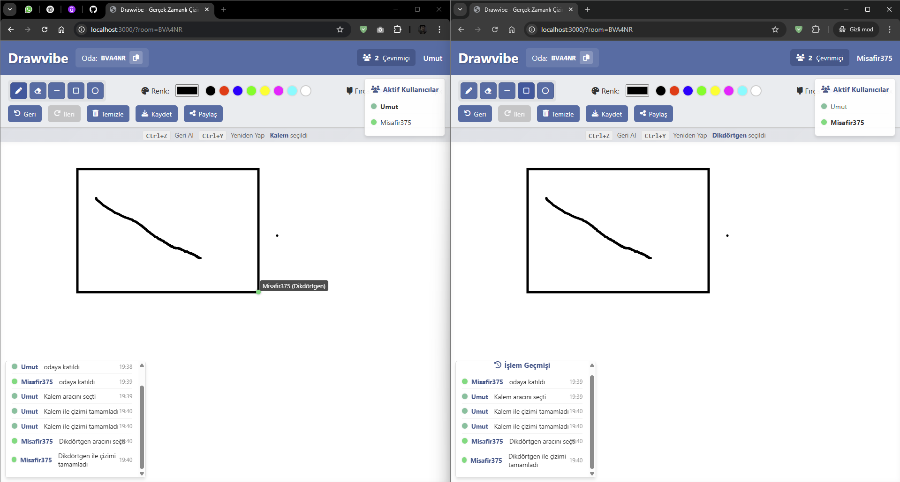
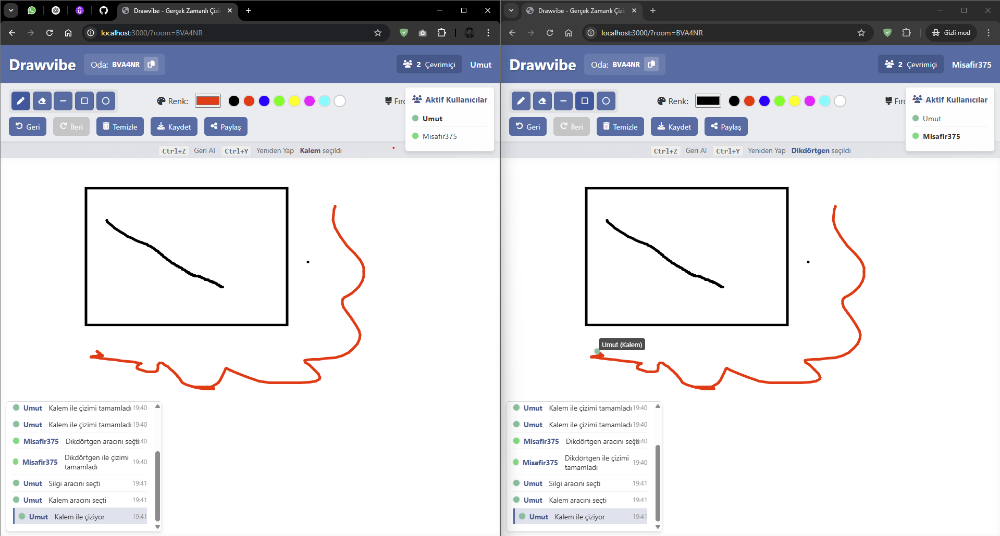

# 🎨 Drawvibe

Drawvibe, insanların yaratıcılıklarını paylaşabilecekleri, gerçek zamanlı olarak birlikte çizim yapabilecekleri bir platformdur. Kullanıcılar yalnızca bir tarayıcıyla giriş yaparak, hiçbir ek yazılıma gerek kalmadan ortak bir tahtada çizim yapabilirler.

## 🚀 Özellikler

- **Gerçek Zamanlı Çizim**: Her kullanıcının yaptığı çizimler anında diğer kullanıcılara iletilir
- **Kullanıcı İmleçleri**: Herkesin mouse imleci gerçek zamanlı olarak gösterilir
- **Fırça Ayarları**: Farklı renk ve kalınlıklar seçilebilir
- **Tahta Temizleme**: Tek tıkla tahtayı sıfırlama
- **Resim olarak indirme**: Çalışmanızı PNG formatında kaydedin
- **Mobil uyumlu**: Dokunmatik cihazlarla da kullanılabilir

## 🛠️ Kurulum

Projeyi yerel ortamınızda çalıştırmak için aşağıdaki adımları izleyin:

```bash
# Repoyu klonlayın
git clone https://github.com/umutsevimcann/drawvibe.git
cd drawvibe

# Bağımlılıkları yükleyin
npm install

# Uygulamayı başlatın
npm start
```

Tarayıcınızda `http://localhost:3000` adresine giderek uygulamayı kullanabilirsiniz.

## 🧰 Teknolojiler

- **Node.js + Express.js**: Web sunucusu
- **Socket.io**: Gerçek zamanlı veri iletişimi
- **HTML5 Canvas**: Çizim işlemleri
- **JavaScript**: İstemci tarafı programlama
- **CSS**: Arayüz tasarımı

## 📷 Ekran Görüntüleri









## 📝 Lisans

MIT Lisansı altında yayınlanmıştır. Detaylar için [LICENSE](LICENSE) dosyasına bakın. 